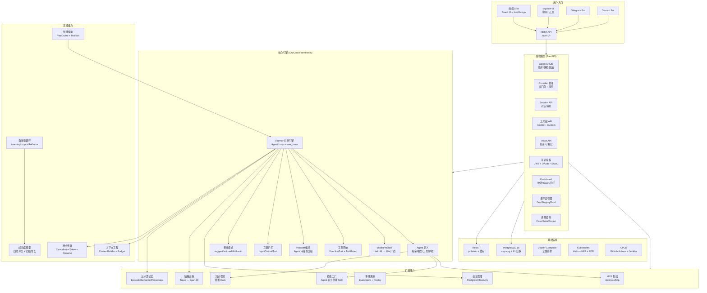
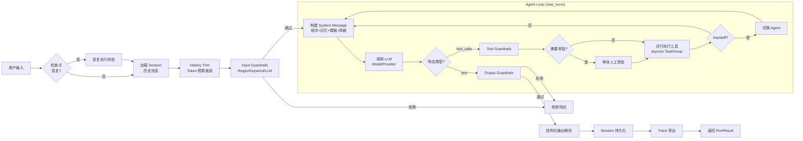
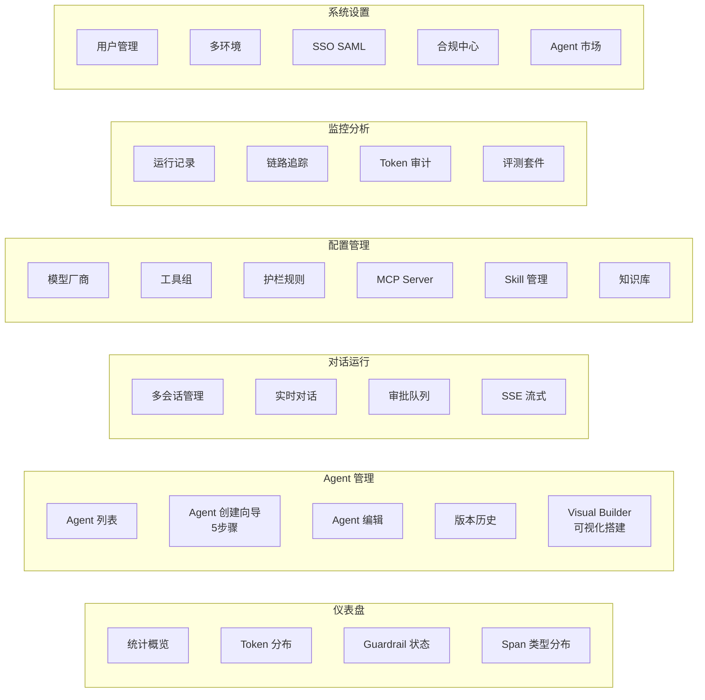

# CkyClaw 系统架构文档

> 最后更新：2026-04-14

## 1. 系统概览

CkyClaw 是基于自研 **CkyClaw Framework** 构建的 AI Agent 管理与运行平台。系统采用 Monorepo 结构，包含三个核心包：

| 包 | 路径 | 技术栈 | 说明 |
|---|---|---|---|
| **ckyclaw-framework** | `ckyclaw-framework/` | Python 3.12+ | Agent 运行时库（独立 pip 包） |
| **backend** | `backend/` | FastAPI + SQLAlchemy | REST API 后端服务 |
| **frontend** | `frontend/` | React 19 + TypeScript | SPA 管理面板 |

基础设施：PostgreSQL 16 + Redis 7，Docker Compose 编排。

---

## 2. 应用启动流程

### Backend 启动 (`create_app()`)

```
1. setup_logging()           → 结构化日志初始化
2. setup_otel()              → OpenTelemetry 初始化（可选）
3. FastAPI(lifespan=lifespan) → 创建应用实例
4. 注册中间件               → AuditLog → RequestID → CORS
5. register_exception_handlers → 全局异常处理
6. 注册 49 个 API 路由模块    → 全部挂载 /api/v1/
7. instrument_fastapi(app)   → OTel 自动埋点

Lifespan 启动:
  → Seed 内置工具组
  → 启动 Redis WebSocket 订阅
  → 启动定时任务调度器

Lifespan 关闭:
  → 停止调度器 → 刷写审计缓冲区 → 停止 Redis 订阅 → 关闭 Redis
```

### Frontend 启动

```
App.tsx (ConfigProvider + Routes + RequireAuth)
  → React.lazy 代码分割
  → BasicLayout (ProLayout 侧边栏)
  → 55+ 路由 → 35+ 页面
```

---

## 3. 架构分层

### 3.1 Backend 分层架构

```
┌─────────────────────────────────────┐
│  API Layer (49 routers, /api/v1/)   │
│  Pydantic v2 请求/响应校验          │
├─────────────────────────────────────┤
│  Service Layer (纯异步函数模块)      │
│  业务逻辑，无状态                    │
├─────────────────────────────────────┤
│  Model Layer (35+ ORM 模型)         │
│  SQLAlchemy Mapped[]，JSONB 存灵活配置│
├─────────────────────────────────────┤
│  PostgreSQL 16 + Redis 7            │
│  asyncpg 驱动 + 连接池              │
└─────────────────────────────────────┘
```

### 3.2 核心基础设施 (`app/core/`)

| 模块 | 职责 |
|------|------|
| `config.py` | `Settings(BaseSettings)`，`CKYCLAW_` 前缀环境变量 |
| `database.py` | 异步引擎 + `get_db()` 依赖注入 + `SoftDeleteMixin` |
| `auth.py` | JWT + bcrypt + Token 黑名单(Redis) + Refresh Token |
| `deps.py` | `get_current_user`、`require_admin` 依赖 |
| `crypto.py` | Fernet 对称加密（API Key 加密存储） |
| `redis.py` | WebSocket pub/sub、Token 黑名单、查询缓存 |
| `middleware.py` | `RequestIDMiddleware`（请求链路 ID） |
| `audit_middleware.py` | `AuditLogMiddleware`（审计日志缓冲写入） |
| `otel.py` | OpenTelemetry SDK + Prometheus metrics |

### 3.3 Frontend 架构

```
┌──────────────────────────────────────┐
│  App.tsx                             │
│  ConfigProvider + Routes + Auth守卫   │
├──────────────────────────────────────┤
│  BasicLayout (ProLayout 侧边栏)      │
│  主题切换 (Zustand themeStore)        │
├──────────────────────────────────────┤
│  Pages (35+ 页面, React.lazy 分割)    │
│  Ant Design 5 + ProComponents        │
├──────────────────────────────────────┤
│  Hooks (TanStack Query)              │
│  useXxxList / useCreateXxx / ...     │
├──────────────────────────────────────┤
│  Services (41 个 service 文件)        │
│  api.ts: fetch wrapper + JWT 注入    │
├──────────────────────────────────────┤
│  Backend API (/api/v1/*)             │
└──────────────────────────────────────┘
```

**状态管理**：Zustand — `authStore` 管理认证状态  
**路由守卫**：`RequireAuth` 检查 token，未登录重定向 `/login`  
**错误边界**：每个路由包裹 `RouteErrorBoundary`

---

## 4. Framework 核心循环

### 4.1 Runner Agent Loop

```
Input
  → [Checkpoint Resume]
  → [Session History Load + Trim]
  → [Input Guardrails]
  → LOOP (max_turns):
      1. Build system message
         (instructions + memory + template vars + response_style)
      2. Call LLM (ModelProvider → LiteLLMProvider → 10+ 厂商)
      3. IF tool_calls:
           → [Tool Guardrails]
           → [Approval Check]
           → Parallel Execute (asyncio.TaskGroup)
           → [Handoff: transfer_to_<name>] → Switch Agent → goto 1
      4. IF text response:
           → [Output Guardrails]
           → [Structured Output Parse]
           → Break
  → [Session Save]
  → [Tracing Export]
  → RunResult
```

### 4.2 Framework 模块层级

| 核心 | 扩展 | 高级 |
|------|------|------|
| `agent/` — Agent 定义 | `guardrails/` — 三级护栏 | `evolution/` — 自改进循环 |
| `runner/` — 执行引擎 | `approval/` — 审批模式 | `orchestration/` — PlanGuard |
| `model/` — LLM 抽象 | `handoff/` — Agent 交接 | `mailbox/` — Agent 间通信 |
| `tools/` — 工具系统 | `mcp/` — MCP 集成 | `checkpoint/` — 断点恢复 |
| `session/` — 会话管理 | `tracing/` — 链路追踪 | `memory/` — 三分类记忆 |
| | `events/` — 事件溯源 | `rag/` — 知识检索 |
| | `skills/` — 技能工厂 | `sandbox/` — 沙箱执行 |

---

## 5. 基础设施

| 服务 | 技术 | 用途 |
|------|------|------|
| **数据库** | PostgreSQL 16 (asyncpg) | ORM 持久化，58 个 Alembic 迁移 |
| **缓存** | Redis 7 | WebSocket pub/sub、Token 黑名单、查询缓存 |
| **追踪** | Jaeger (OTLP) | 链路追踪可视化 (profile: jaeger) |
| **监控** | Prometheus + Grafana | 指标采集 + 仪表盘 (profile: otel) |
| **日志** | Loki + Promtail | 日志聚合 (profile: loki) |
| **容器** | Docker Compose | 全栈编排 |

---

## 6. 功能依赖图谱

### 6.1 核心依赖链

```
                    ┌─────────┐
                    │ Provider │  ← LLM 厂商配置（API Key、Base URL）
                    └────┬────┘
                         │
                    ┌────▼────┐
              ┌─────│  Agent  │─────┐
              │     └────┬────┘     │
              │          │          │
        ┌─────▼───┐ ┌───▼────┐ ┌──▼──────┐
        │  Tools  │ │Handoffs│ │Guardrails│
        │  / MCP  │ │        │ │          │
        └─────────┘ └────────┘ └──────────┘
                         │
                    ┌────▼────┐
                    │ Session │  ← 多轮对话管理
                    └────┬────┘
                         │
                    ┌────▼────┐
              ┌─────│ Runner  │─────┐
              │     └────┬────┘     │
              │          │          │
        ┌─────▼───┐ ┌───▼────┐ ┌──▼──────┐
        │ Tracing │ │ Token  │ │Checkpoint│
        │         │ │ Usage  │ │          │
        └────┬────┘ └────────┘ └──────────┘
             │
        ┌────▼──────┐
        │Evaluation │  ← 使用 Trace 数据评估
        └────┬──────┘
             │
        ┌────▼──────┐
        │ Evolution │  ← 基于评估自动优化
        └───────────┘
```

### 6.2 前端对话链路

```
Chat Page
  → Session API (创建/加载会话)
  → Agent Selection (选择 Agent)
  → Provider (Agent 绑定的 LLM 厂商)
  → Runner (后端执行 Agent Loop)
  → WebSocket (SSE 流式响应)
  → Tracing (自动采集执行数据)
```

### 6.3 完整依赖关系

| 功能 | 依赖 | 说明 |
|------|------|------|
| Chat | Session, Agent, Provider | 核心对话链路 |
| Session | Agent | 会话绑定 Agent |
| Agent | Provider | LLM 调用需要 Provider |
| Tools | Agent | Agent 绑定工具组 |
| Handoff | Agent | Agent 间交接关系 |
| Guardrails | Runner | Runner 执行前后触发 |
| Tracing | Runner | Runner 自动创建 Trace/Span |
| Evaluation | Tracing | 评估基于 Trace 数据 |
| Evolution | Evaluation | 自改进基于评估结果 |
| Approval | Runner | Runner 执行时检查审批 |
| MCP | Tools | MCP Server 工具合并到 Agent |
| Knowledge Base | Agent | RAG 检索注入上下文 |
| Memory | Runner | 构建 system message 时注入 |
| Token Usage | Runner | 自动采集 LLM 调用开销 |
| Checkpoint | Runner | 断点恢复 |

---

## 7. 数据流

### 7.1 请求处理流程

```
HTTP Request
  → CORSMiddleware
  → RequestIDMiddleware (X-Request-ID)
  → AuditLogMiddleware (审计日志)
  → FastAPI Router (路由匹配)
  → Pydantic Schema (请求校验)
  → get_current_user (JWT 认证)
  → Service 函数 (业务逻辑)
  → ORM 操作 (SQLAlchemy async)
  → Pydantic Schema (响应序列化)
  → HTTP Response
```

### 7.2 Agent 执行数据流

```
用户消息 (Chat/API)
  → Session 消息追加
  → History Trim (按 token 预算裁剪)
  → Input Guardrails 检查
  → LLM 调用
      → Tracing Span 记录
      → Token Usage 记录
  → 工具调用（如有）
      → Tool Guardrails 检查
      → Approval 审批（如需）
      → 工具执行 + Span 记录
  → Output Guardrails 检查
  → Session 消息持久化
  → Trace 导出
  → 响应返回
```

---

## 8. 安全架构

| 层面 | 措施 |
|------|------|
| **认证** | JWT + bcrypt + Refresh Token + Token 黑名单 |
| **授权** | Admin/User 角色 + `require_admin` 依赖 |
| **加密** | API Key: Fernet 对称加密存储 |
| **护栏** | Input/Output/Tool 三级 Guardrails |
| **审批** | suggest/auto-edit/full-auto 三种模式 |
| **审计** | AuditLogMiddleware 全量操作审计 |
| **数据** | SoftDeleteMixin 软删除 + 数据分类标签 |
| **合规** | 数据保留策略 + Right-to-Erasure + SOC2 控制点 |

---

## 9. 功能图谱（Mermaid）

### 9.1 系统全景功能图谱



### 9.2 Agent 执行流程图谱



### 9.3 前端页面功能矩阵



### 9.4 API 功能域矩阵

| 功能域 | 端点数 | 关键路由 |
|--------|:------:|---------|
| **Agent** | 8 | CRUD + versions + snapshots + compare + rollback |
| **Provider** | 6 | CRUD + test-connection + sync-models |
| **Session** | 5 | create + list + messages + run + stream |
| **Tool Groups** | 5 | CRUD + seed |
| **Guardrails** | 5 | CRUD + toggle |
| **MCP Server** | 6 | CRUD + test + tools-preview |
| **Tracing** | 4 | traces + spans + waterfall + export |
| **Token Usage** | 3 | stats + by-agent + by-model |
| **Auth** | 8 | login + register + refresh + me + oauth + saml |
| **Users** | 5 | CRUD + roles |
| **Dashboard** | 3 | stats + token-distribution + guardrail-status |
| **Environments** | 5 | CRUD + publish + rollback + diff |
| **Knowledge Base** | 5 | CRUD + upload + search |
| **Skills** | 7 | CRUD + search + find-for-agent |
| **Marketplace** | 8 | browse + publish + install + review |
| **Benchmark** | 12 | cases + suites + runs + reports |
| **Compliance** | 6 | classification + retention + erasure + controls |
| **Cost Router** | 2 | route + test |
| **Approval** | 4 | queue + approve + reject + status |
| **Hooks** | 2 | list + test |
